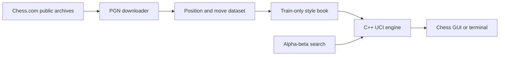

# MarveIous Style Engine

A from-scratch C++ chess engine paired with a Python data pipeline that learns
move preferences from the public Chess.com history of
[`MarveIous`](https://www.chess.com/member/MarveIous).

This initial build already plays legal chess through the UCI protocol and uses
Marvel Harisson's most common move whenever it recognizes a position from the
training set. In unfamiliar positions, it falls back to alpha-beta search.

> This project is for offline study, engine development, and post-game
> analysis. Do not use it to obtain assistance during live games.

## Current Results

The included analysis was generated from the account's public game archive on
June 20, 2026.

| Measurement | Result |
| --- | ---: |
| Downloaded games | 511 |
| Usable games | 509 |
| Personal move decisions | 14,740 |
| Train / validation / test decisions | 9,902 / 2,426 / 2,412 |
| Test positions recognized by the baseline | 12.23% |
| Correct first choice when recognized | 88.81% |
| Correct choice in top three when recognized | 95.93% |

The high accuracy applies only to recognized positions, which are mostly
repeated opening positions. Overall test-set top-1 matching is currently
10.86%. A candidate-move model is the next step toward matching style in
positions that have not appeared before.

See [`reports/style_report.md`](reports/style_report.md) and
[`reports/baseline_metrics.json`](reports/baseline_metrics.json) for the full
generated results.

## Architecture



- **C++20 engine:** FEN parsing, complete legal move generation, castling,
  en passant, promotion, check detection, perft, material evaluation, and
  alpha-beta negamax search.
- **Python pipeline:** Chess.com archive download, PGN parsing, chronological
  train/validation/test splitting, style analysis, and baseline evaluation.
- **Personalization:** a train-only position book stores Marvel's move
  distribution and lets the UCI engine reproduce the most frequent choice.

## Quick Start

Requirements: Python 3.11+, a C++20 compiler, and `make`.

```bash
python3 -m venv .venv
.venv/bin/pip install -e '.[dev]'
make engine
make test
```

Download the current public game history and regenerate all data and reports:

```bash
make data
```

The raw PGN and generated decision data are deliberately ignored by Git. This
keeps the repository small and makes the analysis reproducible from its public
source.

## Run the Engine

### Browser Chessboard

Launch the playable local GUI:

```bash
make gui
```

Your browser opens at `http://127.0.0.1:8765`. Choose White or Black, then click
a piece and a highlighted legal square. The board rotates to keep your side at
the bottom, and the engine makes the first move when you play Black. The engine
can follow the Evans, Englund, Stafford, Fried Liver, Fishing Pole, and
anti-Sicilian opening lines before falling back to your style book and
alpha-beta search. Press `Control-C` in the terminal to stop it.

The interface is local and intended only for offline engine testing.

### Terminal UCI

Run from the repository root so the default style-book path is available:

```bash
./engine/build/marvelous-engine
```

Then enter standard UCI commands:

```text
uci
isready
position startpos
go depth 4
quit
```

The executable can also run a move-generation benchmark directly:

```bash
./engine/build/marvelous-engine --perft 4
```

To use a style book stored elsewhere, a GUI can send:

```text
setoption name StyleBookPath value /absolute/path/to/style_book.tsv
```

## Data Commands

The installed `marvelous-style` command exposes every pipeline stage:

```bash
.venv/bin/marvelous-style download --username MarveIous --out data/raw
.venv/bin/marvelous-style build --username MarveIous \
  --pgn data/raw/MarveIous.pgn --out data/processed
.venv/bin/marvelous-style report --username MarveIous
.venv/bin/marvelous-style evaluate
```

Splits are chronological by game, not random by individual move. The style
book is built from the training split only, preventing validation and test
moves from leaking into predictions.

## Roadmap

1. Add iterative deepening, time controls, quiescence search, and a
   transposition table.
2. Improve evaluation with piece-square tables, mobility, pawn structure,
   king safety, and tapered middlegame/endgame scores.
3. Train a candidate-move reranker to generalize style beyond exact repeated
   positions.
4. Tune the strength/style balance and publish reproducible top-1 and top-3
   results against the untouched test split.
5. Add a small analysis interface that compares the engine's choice, Marvel's
   choice, and a conventional engine choice.

## Author

Marvel Harisson, Computer Science undergraduate at Ritsumeikan University,
Osaka Ibaraki Campus. Contact: [im.marvel.harisson@gmail.com](mailto:im.marvel.harisson@gmail.com)

Licensed under the [MIT License](LICENSE).
